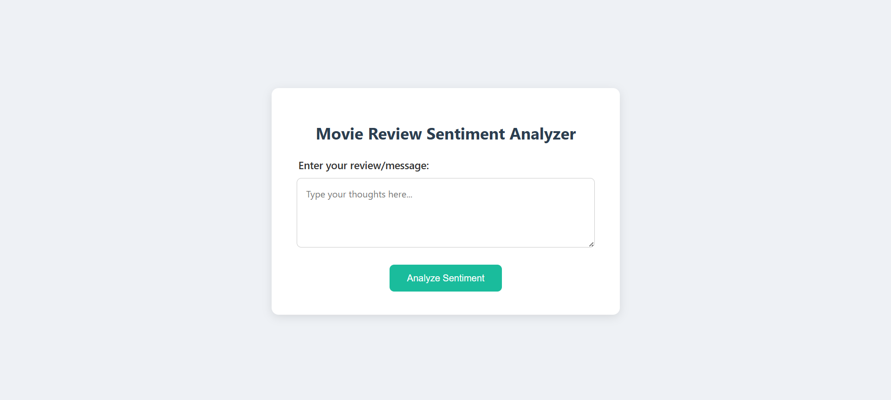
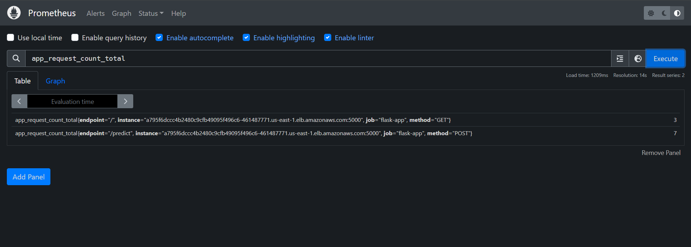

## 🎬 Movie Review Sentiment Analyzer — End-to-End MLOps Project
An industry-grade, fully automated sentiment analysis pipeline showcasing a production-ready MLOps workflow—from data ingestion and versioning to model training, CI/CD, deployment on Kubernetes, and real-time monitoring.


### 🚀 Overview
This project delivers a comprehensive MLOps workflow, covering the full machine learning lifecycle—from secure data ingestion, reproducible training, and model tracking to containerized deployment and live system monitoring. Built for real-world MLOps adoption, it leverages powerful open-source tools and AWS-native services.

---

### 🚀 Major Highlights
    🔄 Fully Automated End-to-End Pipeline — One-click MLOps: from ingestion → deployment → monitoring
    ♻️ Reproducibility by Design — Every pipeline stage is versioned and rollback-capable
    🧠 Experiment-Driven Development — All model versions compared objectively; best models promoted
    🏗️ Cloud-Native & Scalable — Docker + ECR + EKS ensure high availability and portability
    📡 Observability at Scale — Live dashboards and alerts powered by Prometheus & Grafana

---

### 🧠 Key Features
    ✅ Binary Sentiment Classification — Classifies movie reviews as Positive or Negative
    ☁️ Data Ingestion from AWS S3 — Pulls raw data directly from a secure and scalable S3 bucket
    📦 Data & Pipeline Versioning with DVC — Tracks datasets, code, and pipeline stages
    📈 Experiment Tracking with MLflow (via DagsHub) — Logs metrics, parameters, and models; includes model registry
    🔁 Automated CI/CD with GitHub Actions — From testing to training and deployment
    🐳 Containerization with Docker — Flask app packaged and pushed to AWS ECR
    🧪 Model Serving with Flask REST API — Lightweight, Dockerized API for predictions
    ☸️ Deployment with Kubernetes on AWS EKS — Manages scaling, load balancing, and orchestration
    📊 Real-Time Monitoring with Prometheus & Grafana — Tracks system and model performance in production

---

🛠️ Tech Stack & Tools
| **Category**             | **Technology / Tools**                                                               |
| ------------------------ | ------------------------------------------------------------------------------------ |
| **Language**             | Python                                                                               |
| **Frameworks**           | Flask, scikit-learn                                                                  |
| **Data Ingestion**       | AWS S3, `boto3`                                                                      |
| **Data Versioning**      | DVC (with remote storage on DagsHub)                                                 |
| **Experiment Tracking**  | MLflow (hosted via DagsHub)                                                          |
| **Model Serving**        | Flask REST API, Docker                                                               |
| **CI/CD Automation**     | GitHub Actions                                                                       |
| **Container Registry**   | AWS Elastic Container Registry (ECR)                                                 |
| **Orchestration**        | Kubernetes via AWS Elastic Kubernetes Service (EKS)                                  |
| **Monitoring & Metrics** | Prometheus (scraping), Grafana (dashboard visualization)                             |
| **Project Scaffold**     | Cookiecutter                                                                         |
| **Dependencies**         | pipreqs                                                                              |


---

## 🔄 Pipeline Workflow

### 1. 📦 DVC Pipeline
- Tracks and versions:
  - Data ingestion (fetched securely from AWS S3 via boto3)
  - Preprocessing
  - Feature extraction using Bag-of-Words
  - Model training & evaluation
- Reproducible with:
  ```bash
  dvc repro
  ```

### 2. 🤖 Model Tracking
- MLflow hosted via **Dagshub**
- Registers best-performing models
- Promotes to `Production` stage via automated CI/CD

### 3. ⚙️ CI/CD Automation
- Triggered on push via GitHub Actions
- Runs:
  - Unit tests
  - DVC pipeline
  - Flask API tests
  - Model registry updates
  - Docker image build and push to ECR
  - Deploy to AWS EKS

---


## ☸️ Kubernetes Deployment (AWS EKS)

- Cluster created using `eksctl`
- Flask app deployed as two pods behind a LoadBalancer
- Docker image pulled from ECR
- CI/CD automates EKS deployment via `deployment.yaml`

---

## 📊 Monitoring with Prometheus & Grafana

- Metrics exposed from Flask app:
  - `app_request_count_total`
  - `app_request_latency_seconds`
  - `model_prediction_count_total`
- Prometheus scrapes metrics
- Grafana dashboard shows:
  - Request rates
  - Latency percentiles
  - Prediction counts by class


---
## 📸 Application Preview



---

## 📊 Prometheus Monitoring

### 🔍 Prometheus Targets View


---

## 📈 Grafana Dashboard


---

## 📘 Resources

- 📚 [DVC Docs](https://dvc.org/doc)
- 📚 [MLflow on Dagshub](https://dagshub.com)
- 📚 [AWS EKS Setup](https://docs.aws.amazon.com/eks/)
- 📚 [Prometheus & Grafana Monitoring](https://prometheus.io/docs/)

---

## ✨ Author

👤 **Ganesh Pasnurwar**  
🔗 [GitHub Profile](https://github.com/ganeshsp7)

---

## 🏁 Final Remarks

This project showcases a complete production-grade MLOps pipeline using modern open-source tooling and cloud-native deployment strategies. Perfect for learning real-world deployment, monitoring, and automation best practices.

---
